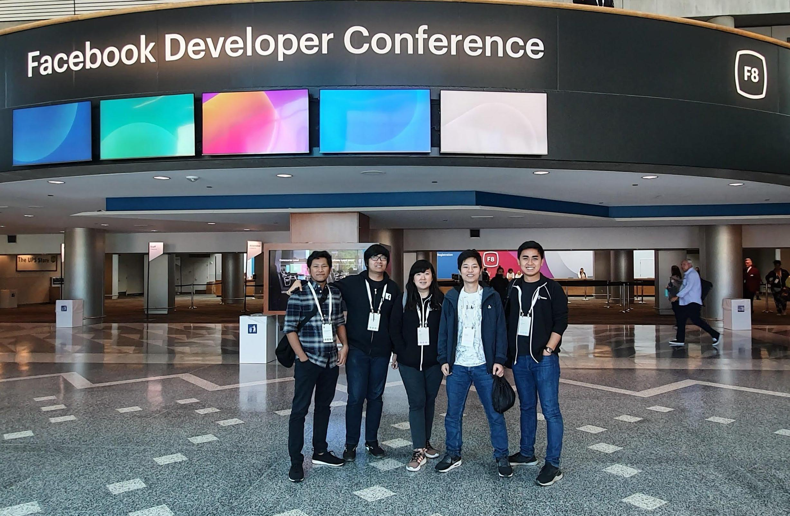
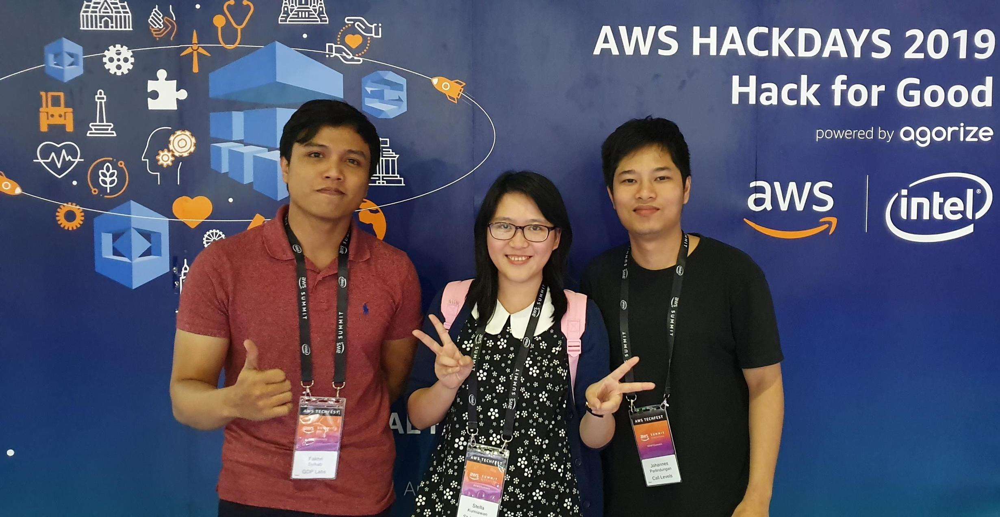
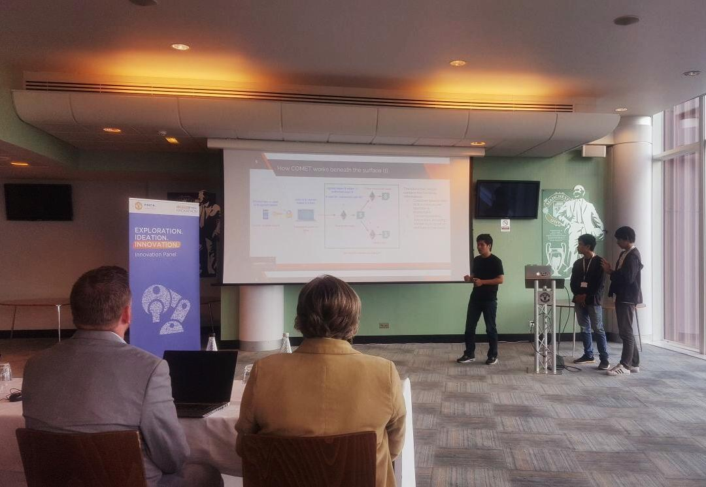
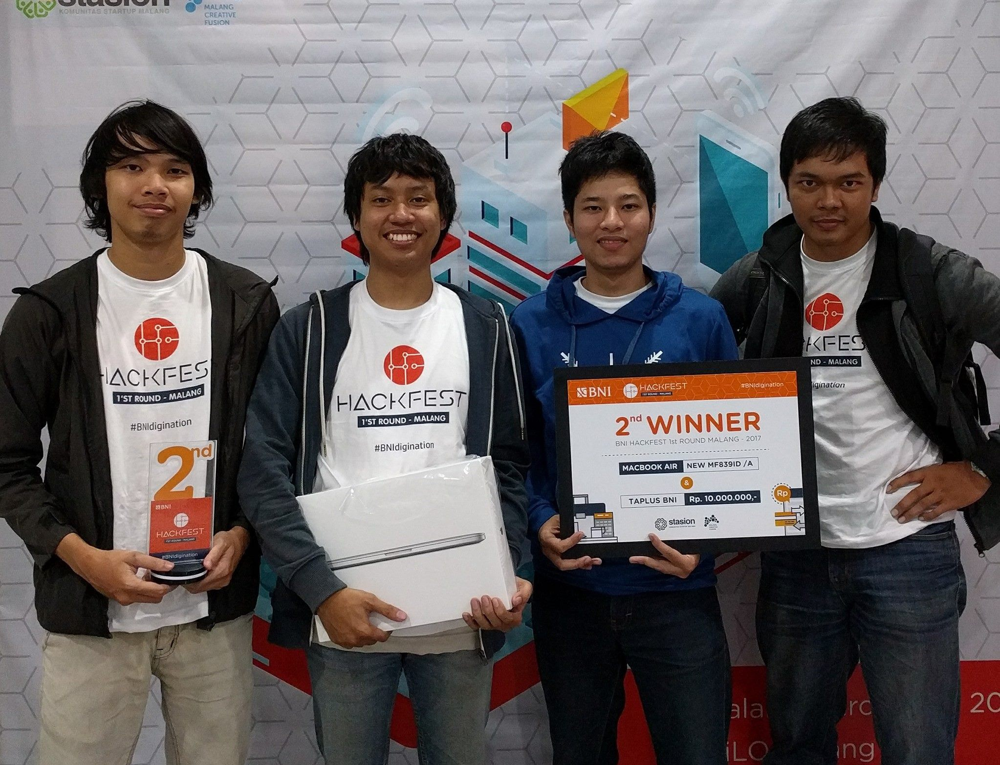

---

### FOSSASIA Summit 2020 

<iframe width="1440" height="900" src="https://www.youtube.com/embed/lH1kYKF1V0E?t=4" frameborder="0" allow="accelerometer;
autoplay; encrypted-media; gyroscope; picture-in-picture" allowfullscreen></iframe>

In March 2020, I gave a talk with title 
"High Performance Location-based Restaurant Campaigns in Foodpanda" in 
[FOSSASIA Summit](https://summit.fossasia.org). 
This talk highlights how my team solved our problem where our 
service needs to return the list of campaigns based on 
the user location and the delivery 
areas of the restaurants participating in the campaigns. 
We have around 10 active campaigns per country,
around 9 thousand restaurants per campaign, and 10 delivery areas per restaurant. 
In other words, we need to do around 900 thousand location checks 
for all delivery areas for each user request.

Our service can handle more than 400 thousand requests per minute, 
around 17 times more than the 
real peak throughput at that time, 
which is 23.7 thousand requests per minute. 

---

### Facebook F8 Hackathon 2019

In 2019, I was shortlisted again to attend [F8 Hackathon](https://f82019.devpost.com) 
and [F8 Facebook Developer Conference](https://www.f8.com). 
My team built a computer vision powered application to report bullying activities at schools.

---

### AWS Hackdays 2019

My team won the 1st place of AWS Hackdays 2019 Indonesia and secured the 3rd place 
in the Grand Final in Singapore. We built two products for this competition. 
[Aident](/aident), a real-time crime activity detection and criminals face recognition system. 
The second one is [Eyve](/eyve), it is built to protect visually impaired in daily life. 

<iframe width="1440" height="900" src="https://www.youtube.com/embed/YKPRNlpmyno" frameborder="0" allow="accelerometer;
 encrypted-media; gyroscope; picture-in-picture" allowfullscreen></iframe>

---

### National Data Science Challenge Singapore 2019
[NDSC](https://www.kaggle.com/c/ndsc-advanced) is a data science competition in Singapore 
organized by Shopee. 
This was my first time participating in a data science competition. 
My team managed to get to the top 50 out of 111 teams for Advanced Category.

---

### F10 Fintech Hackathon Singapore 2018
[F10 Fintech Hackathon](https://www.f10.ch/fintech-hackathon/singapore2018) 
is an international hackathon hosted by F10 in Singapore. 
In this event, my team built [Patrons](/patrons), a new way to visualize and display financial data by providing 
personalized virtual experience monitoring using Virtual Reality technology.
We were selected as the top 10 in this hackathon.

---

### Facebook F8 Hackathon 2018
In 2018, I was shortlisted and got a free trip sponsored by Facebook 
to attend [F8 Hackathon](https://hackf8.devpost.com) in San Jose, California. 
This hackathon is a part of [F8 Facebook Developer Conference](https://www.f8.com) event. 
In this event, my team built [Novus](/novus), an Augmented Reality based social network. 

---

### Line Creativate Chatbot Competition 2017
In this competition, my team developed a game chatbot [Clovero](/clovero), an Indonesian 
culture themed word guessing game. It was then selected as the top 50.

---

### Kode Indonesia 2017
Kode Indonesia is a national programming competition held by [Kalibrr](https://www.kalibrr.com).
I managed to be one of the top 50 finalists in this competition. 

---

### United By HCL Hackathon 2017

In 2017, my team competed with around 2000 teams and was selected as 
one of the top 4 teams (for Blockchain category) 
to present our project in the final event of UnitedByHCL Hackathon, a global hackathon held by 
Manchester United and HCL Technologies in Manchester. 
My team's project is [Comet](/comet), an offline payment solution that leverages 
the power of blockchain.

---

### Jenius BTPN Hackathon 2017
In this hackathon, my team built the third version of [Ceki](/ceki).
Here, we were selected as one of the top 10 teams.

---

### BNI Hackfest Malang 2017

In this competition, my team built the second version of [Ceki](/ceki) and then we got awarded as the 2nd winner.

---

### AirAsia Airvolution Hackathon 2017
AirAsia Airvolution Hackathon 2017 is the first hackathon organised by [AirAsia](https://www.airasia.com).
My team was selected to represent Indonesia to compete with the other 20 teams from other countries. 

---

### Bank Rakyat Indonesia Hackathon 2016
In this hackathon, my team was selected as one of the top 10 teams. 
The project we built here was [Ceki](/ceki), a QR code based payment system.

---

### Kaskus HP Startgaming Competition 2015
Kaskus HP Startgaming Competition is a gaming competition held by [Kaskus](https://kaskus.co.id).
My team won the 2nd place in this competition.

---

### IBM Developer War Day 2015
IBM Developer War Day is a software development competition held by IBM Indonesia.  
My team built a city reporting system and was selected as a finalist.

---

### Indigo Apprentice Awards 2015
My team was selected as a finalist in this event with our project [Qololo](/qololo).

---

### Indigo Incubator 2015
My team was selected as a finalist in this event with our project [Qololo](/qololo).

---

### Bandung Open Data Challenge 2015
This competition was held by the Government of Bandung city and Bank Indonesia. 
Here, my team was selected as one of the top 3 finalists for Economic Category.

---

### Gemastik (Pagelaran Mahasiswa Nasional bidang Teknologi Informasi dan Komunikasi) VII 2014
Gemastik is the biggest student information technology competition in Indonesia. 
Here, my team won the 2nd place for Business Game Category. 

---

### Computer Festival University of Indonesia 2014
[Computer Festival](https://compfest.id) is an annual information technology competition 
held by University of Indonesia.
Here, my team's project [Gasing Evo](/gasing-evo) was awarded "Excellence in Game Arts" 
for game category.

---

### INAICTA (Indonesia ICT Awards) 2014
INAICTA is the biggest information and communication technology event in Indonesia.
In this competition, my team's project, [Gasing Evo](/gasing-evo), an action arcade game for mobile 
and PC made to mimic Indonesian traditional game “Gasing”, was nominated 
for "Best Student Game Development" award.

---

### Institut Teknologi Bandung Chess Competition 2013
My team won the 1st place in this chess competition.

---

### Gemastik (Pagelaran Mahasiswa Nasional bidang Teknologi Informasi dan Komunikasi) VI 2013
Gemastik is the biggest student information technology competition in Indonesia. 
In this competition, my team won the 3rd place for Intelligent System Category.

---

### Kejurnas (Kejuaraan Catur Nasional Mahasiswa) 2011 and 2012
Kejurnas is Indonesia's national college student chess competition. 
I was one of the students representing my university in this competition in 2011 and 2012. 
