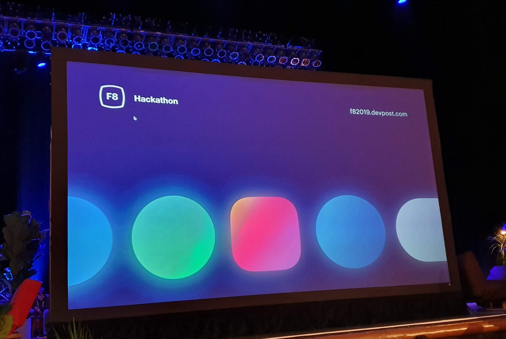

### FOSSASIA Summit 2020 

<iframe width="1440" height="900" src="https://www.youtube.com/embed/lH1kYKF1V0E?t=4" frameborder="0" allow="accelerometer;
autoplay; encrypted-media; gyroscope; picture-in-picture" allowfullscreen></iframe>

In March 2020, I gave a talk with title 
"High Performance Location-based Restaurant Campaigns in Foodpanda" in 
FOSSASIA Summit. This talk highlights how we solve our problem where our 
service needs to return the list of campaigns based on 
the user location and the delivery 
areas of the restaurants participating in the campaigns. 
We have around 10 active campaigns per country,
around 9000 restaurants per campaign, and 10 delivery areas per restaurant. 
In other words, we need to do ~900 thousand location checks 
for all delivery areas for each user request.

Our service can handle more than 400 thousand requests per minute, 
around 17 times more than the 
real peak throughput at that time, 
which is 23.7 thousand requests per minute. 

### Facebook F8 Hackathon 2019

My team built a computer vision powered application to report bullying activities at schools.

### AWS Hackdays 2019

My team won the 1st place at AWS Hackdays 2019 Indonesia and secured the 3rd place position at the Grand Final in 
Singapore. We built two products for this competition. Aident, a real time crime activity detection and criminals face recognition system. Second one is Eyve, it is built to protect visually impaired in daily life. 

