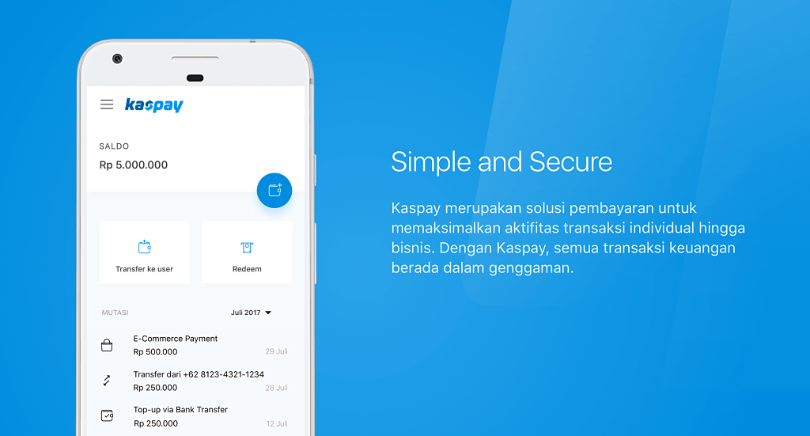

### Delivery Hero - Foodpanda & Foodora (2019 - present)
[Delivery Hero](https://www.deliveryhero.com) is one of the leading global online food ordering 
and delivery marketplaces. It processes more than 3 million orders per day, partnering with 
over 500 thousand restaurants and a fleet of riders. 
It operates across Europe, Latin America, Asia-Pacific, the Middle East and North Africa.

Here, I'm currently working on the backend for campaign related features inside [Foodpanda](https://www.foodpanda.com) 
and [Foodora](https://www.foodora.com) using Go, Redis, DynamoDB, Kubernetes, 
with Amazon Web Service as our main infrastructure. Our main service can handle more than 400 thousand 
requests per minute. 

### Call Levels (2018 - 2019)

[Call Levels](https://www.call-levels.com) is a market monitoring mobile application, that services more than 500 
thousand investors globally. 

In Call Levels, I was working on the new backend for the price monitoring and notification system 
using Go and Google Cloud Platform technologies (such as Google Kubernetes Engine). 
My team's main goal was to create a new backend with better performance compared with the 
previous backend app.

I was also working on the backend for Call Levels chat solution using is Node.js and Google Dialogflow.

### GDP Labs (2015 - 2018)

GDP (Global Digital Prima) Labs, founded in 2012, is a software product development-centric 
organization based in Indonesia.
It's main goal is to help sister companies and incubate startups.

In GDP Labs, I was mainly working on two big projects from [Kaskus](https://kaskus.co.id),
the biggest online forum in Indonesia. The projects are 
Kaskus Big Data and [Kaspay](https://kaspay.com). 
 
#### Kaskus Big Data

My team built the data pipeline in Kaskus using Google Cloud Platform 
(e.g. Dataflow, PubSub, BigQuery) and Apache Airflow.
We stored the whole data inside BigQuery. Then it can be used for data analyst to create reports and 
data scientist to build machine learning models.

#### Kaspay 

Kaspay consisted of payment bot (available at FB Messenger, Telegram, Line, and Kaskus Chat), 
wallet, voucher, and invoice system which are developed with Spring Framework with Java 8 for the backend, 
and React for the frontend.

