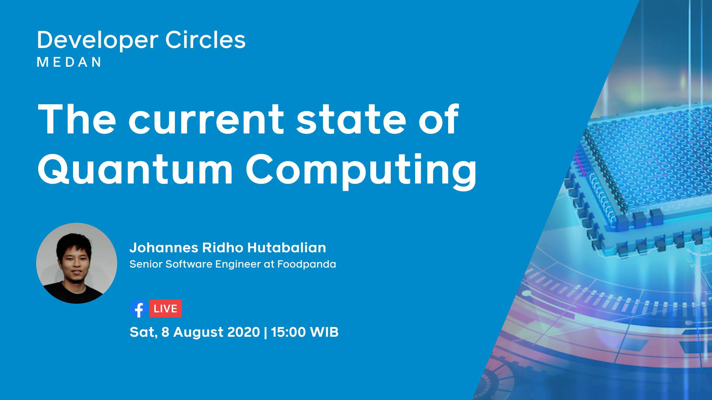

---

### FOSSASIA Summit 2020 
<iframe width="1440" height="900" src="https://www.youtube.com/embed/lH1kYKF1V0E?t=4" frameborder="0" allow="accelerometer;
autoplay; encrypted-media; gyroscope; picture-in-picture" allowfullscreen></iframe>

In March 2020, I gave a talk with title 
"High Performance Location-based Restaurant Campaigns in Foodpanda" in 
[FOSSASIA Summit](https://summit.fossasia.org). 
This talk highlighted how my team solved a problem where our 
service needs to return the list of campaigns based on 
the user location and the delivery 
areas of the restaurants participating in the campaigns. 
This service is now able to handle more than 700 thousand requests per minute.
 
Find more details [here](/foodpanda-campaign-carousel).

---

### Facebook Developer Circles Medan Event August 2020

In this event, I gave a talk about the current state of quantum computing. I also demonstrated how to create
a simple coin flip program and run it on a real quantum computer provided by IBM Quantum Experience.

Links: [video](https://www.facebook.com/1395271301/videos/10223864897235751) (in Indonesian language), 
[slide](https://docs.google.com/presentation/d/14q9QUHG95Hb7W9C39GWaX_6b4Ds_dRqUWtGRPI-RqqY/edit?usp=sharing),
[code](https://github.com/johannesridho/quantum-coin-flip)

---

### Facebook Developer Circles Bandung Event June 2018
This time I presented about how to create a Virtual Reality application using Unity Game Engine and run it
in Oculus Go.

Links: [slide](https://docs.google.com/presentation/d/1gKiZjflNSX4MSxUf_K3t7qpPfkxrNDnuNZKYVTWyrKs/edit?usp=sharing),
[code](https://github.com/johannesridho/simple-vr-app) 

---

### Facebook Developer Circles Jakarta Event May 2018
In this event, I gave a talk about building Augmented Reality applications using Unity Game Engine and Vuforia.

Links: [slide](https://docs.google.com/presentation/d/1r9Qv7Nh4JxB_VFA0f7pZlhcpDBMLWEZv-Sgk40F-hoo/edit?usp=sharing)
[code](https://github.com/johannesridho/simple-ar-app)  
