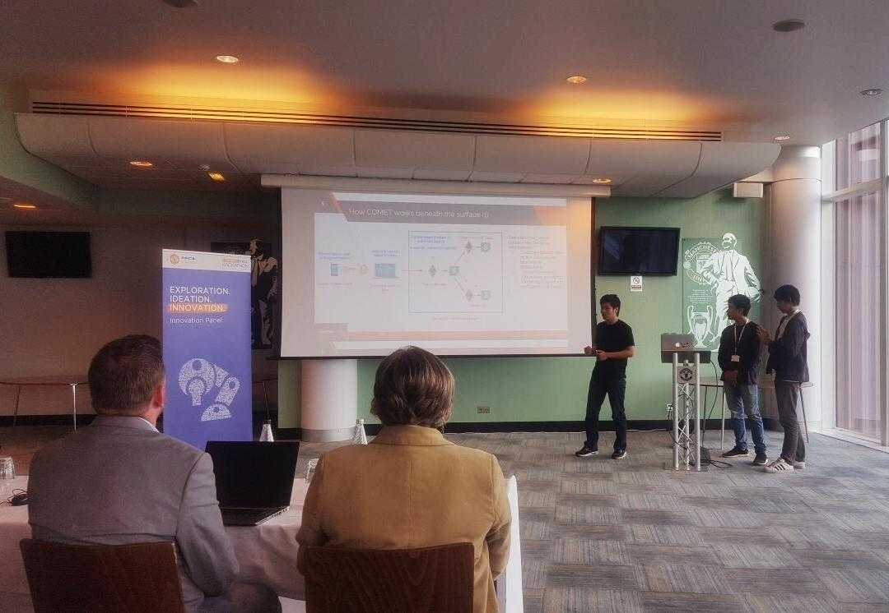

In 2017, my team competed with around 2000 teams and was selected as one of the top 4 teams (for Blockchain category) to present our project in the final event of UnitedByHCL Hackathon, a global hackathon held by Manchester United and HCL Technologies in Manchester. My team’s project is Comet, an offline payment solution that leverages the power of blockchain.