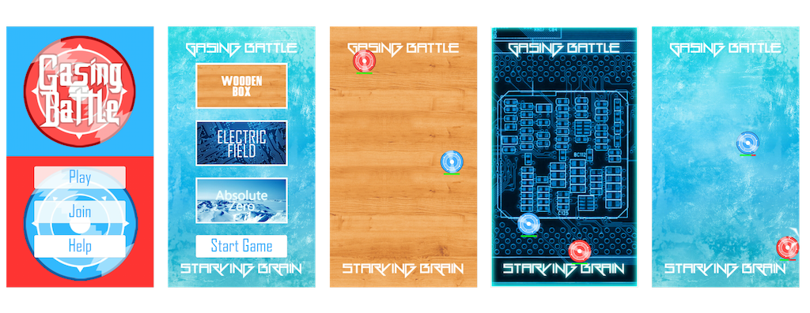

Gasing Battle is an Android game where the player controls a Gasing, 
a traditional toy from Indonesia, to battle with another player 
by tilting the mobile phone. 
The goal of this game is to be a winner by keeping 
the Gasing spin as long as possible. 
A player can beat the opponent by hitting 
opponent's Gasing or makes the opponent's Gasing hit the wall 
until it's Healthpoint is depleted.

Gasing Battle was published in Google Play Store with total users 
around 30 thousand in 3 years without any marketing effort.
It was also awarded as the 3rd runner up in 
[ITB Samsung App Challenge 2013](https://stei.itb.ac.id/id/blog/2014/05/06/tim-stei-itb-juara-pertama-pada-kegiatan-samsung-student-ambassador-2014).