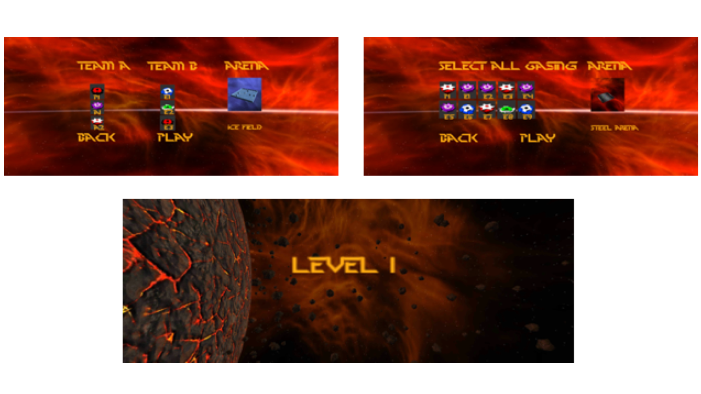

Gasing EVO is an action arcade game for mobile and PC made to mimic Indonesian traditional game “Gasing”.
Gasing EVO has many features including multi-player mode, voice command, and remote play. 

 
This game was nominated for "Best Student Game" in 
Indonesia ICT Awards 2014.

