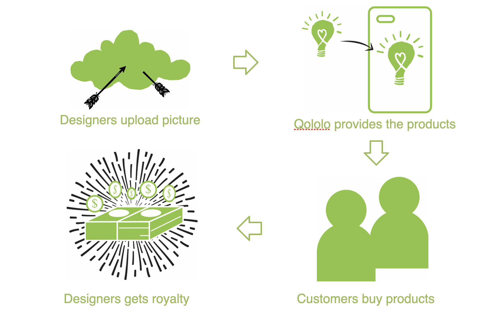

Qololo is a marketplace website for art designer. This project is my first attempt in doing a startup. In the end, we have 89 users, 168 designs submitted, 3727 Twitter followers, 2332 Instagram followers, 742 email subscriber, and 309 likes in Facebook.