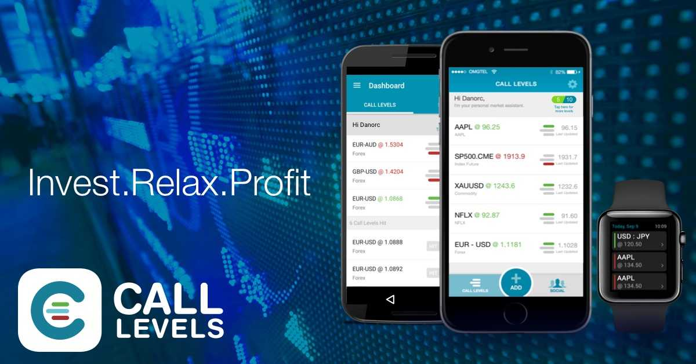

[Call Levels](https://www.call-levels.com) is a market monitoring mobile application with more than 500 thousand investors globally. At Call Levels, I built the backend for the price monitoring and notification system using Go, Redis, and Google Cloud Platform technologies (such as Google Kubernetes Engine). My team’s main goal was to create a new backend with better performance compared with the previous backend app. The new backend was able to handle ~1 million concurrent price hits and send the notification to the users in a few seconds.

Before that, I was also working on the backend for Call Levels chat solution using Node.js and Google Dialogflow.