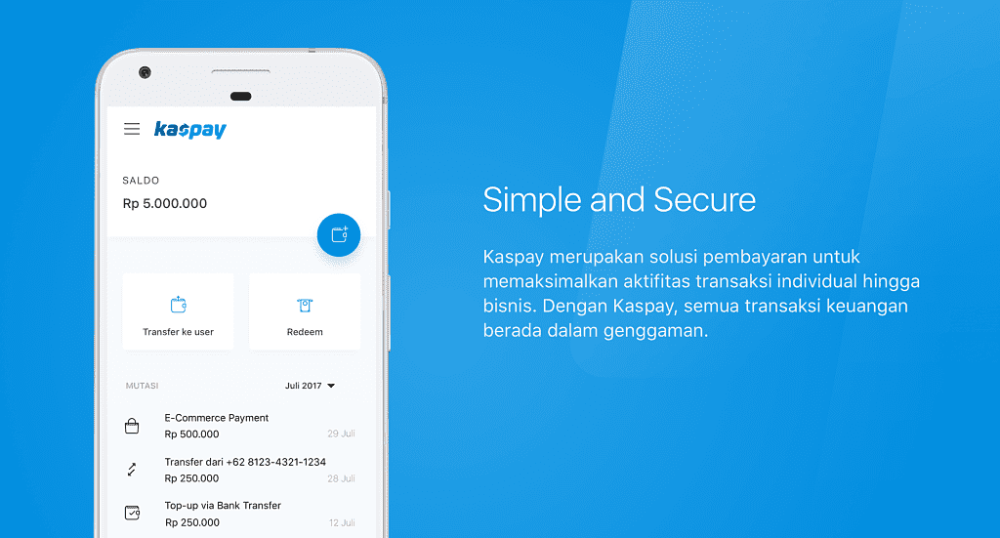

[GDP Labs (Global Digital Prima) Labs](https://www.gdplabs.id), is a software product development-centric organization based in Indonesia. It’s main goal is to help sister companies and incubate startups. GDP Labs is a part of [GDP Venture](https://gdpventure.com).

At GDP Labs, I was mainly working on two big projects from [Kaskus](https://www.kaskus.co.id), the biggest online forum in Indonesia with more than 25 million users. The projects are [Kaspay](https://kaspay.com) and Kaskus Big Data.

Kaspay consists of payment bot (available on FB Messenger, Telegram, Line, and Kaskus Chat), wallet, voucher, and invoice system developed using Java (with Spring Framework) for the backend, and React for the frontend.

After Kaspay, I worked on Kaskus Big Data. Kaskus Big Data team was responsible for providing Data Warehouse and Data Mart for data analysis and building Machine Learning models in Kaskus. We built the data pipeline in Kaskus using Google Cloud Platform (Dataflow, PubSub, BigQuery) and Apache Airflow.